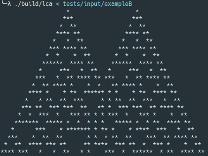
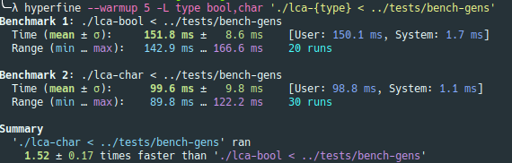
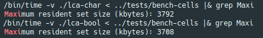
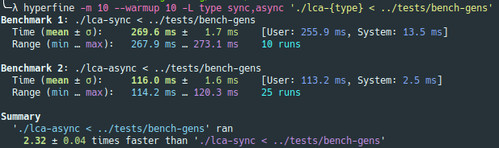
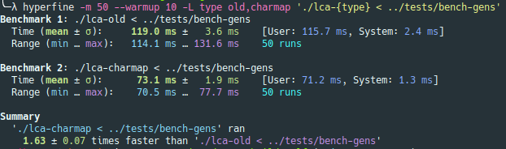
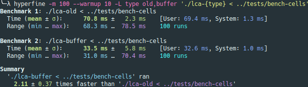
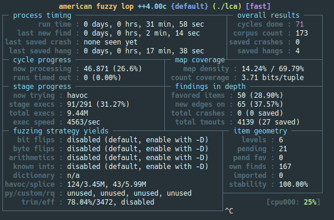

# Linear Cellular Automata
### Decode Demcon: Challenge #2 in C++
[](https://github.com/SibrenVasse/Demcon-LCA/actions/workflows/buildtest.yml)
[](https://github.com/SibrenVasse/Demcon-LCA/actions/workflows/clang-format.yml)


[Description](#description) •
[Compilation and usage](#compilation-and-usage) •
[Challenge Criteria](#challenge-criteria)

## Description
This project is a submission for the 'Decode Demcon' Challenge #2.

To solve the problem specified in the challenge I set out to create the following:

#### Application specification
1. Program reads configuration from standard input in the format specified in the challenge:

```bash
# Whitespace (one space in the specification below) can be any number of combinations of space, \t, \n, \r between the values
# This was done because the challenge was vague about this point, but left out of the regex below to improve readability

[AB] \d+ \d+ init_start[ \d]{1,} init_end
or
U \d+ \d+ init_start[ \d]{1,} init_end[ \d]{8}]

# Example:
A 10 10 init_start 6 init_end
# But this is also valid (newline seperated):
A
10
10
init_start
6
init_end
```
2. The program must calculate new generations based on the configuration specified in the input.
3. Program outputs every generation to standard out in the format specified in the challenge, using the function provided. Using `*` for an occupied cell, `space` for an unoccupied cell, and every generation on a new line.
```
     *
    * *
   * * *
  * * * *
 * * * * *
* * * * * *
 * * * * *
* * * * * *
 * * * * *
* * * * * *
```

## Challenge Criteria
As the problem itself is not a very hard one to solve, I focused on the judging criteria that were specified in the assignment. Below I'll try to explain my thoughts and how I tried to keep these points in mind.
- **Efficiency**

  My first thought when reading the word 'efficiency' was 'speed'. This, in part, influenced my choice for C++ over the other allowed languages. Even though that's not entirely fair to those languages.

  The time complexity of the program is `O(n)` for both the number of generations and the number of cells. The program does not do any (re)allocation for thew new generations, so the memory complexity is also `O(n)`.

  Two benchmarks are available under `tests/bench*`. One with 100 cells and 100'000 generations (my machine: ~40ms), and one with 100'000 cells and 100 generations (my machine: ~35ms). Most of this time is spent on sending output to std::cout. When the program is compiled with `-DDISABLE_OUTPUT=ON` it takes just ~10ms. With this option you can more easily benchmark the internal calculations of the program, without the extra noise.

  These benchmarks were used to do a more in depth review of the performance of the program. Using `perf record ./lca < ../tests/bench-cells` to record performance data and the result with [Hotspot](https://github.com/KDAB/hotspot). These identified two 'hotspots' in the program: `Automaton::evolve()` and `lca::operator<<`, which was no surprise as these are doing most of the work. These two then became my main focus when improving the performance of the program.

  For some details on performance, and the analyses I did, and to see where I deviated from the provided implementation [here](https://github.com/JeroenVerberneDemcon/DecodeDemcon/blob/main/main.cpp), see: [Implementation details](#implementation-notes).

- **Good coding practices**

  Seeing as 'Good coding practices' is a very broad term, I created a small list of concrete things I did to reach this goal:

  - [**Static code analysis**](#static-analysis-linux)
  - [**System testing**](#system-tests-linux)
  - [**Enforcing a code style**](#enforcing-code-formatting-linux)
  - [**Fuzzing**](#fuzzing-linux)
  - **Continuous integration**

    It is a good practice to run some tests when pushing code or creating a merge request. There are two Github Actions configured. One to enforce code style, and one to compile the project and run the [tests](#system-tests-linux).

  - **Compiler warnings**

    Compiler warnings can be very useful to help find possible issues in the codebase. I tried to find a good balance by enabling as many types of warnings as possible without having too many useless messages and false negatives. See [CMakeLists.txt](CMakeLists.txt).

  - **Sanitizers**

    For the debug configuration on GCC and Clang the AddressSanitizer and UndefinedBehaviorSanitizer are enabled. Sanitizers can help finding bugs like buffer overflows (ASAN) and undefined behavior (UBSan).

  - **Good input validation**

    Defensive programming: good input validation is very important to create good software. See `parseInput()` in [main.cpp](src/main.cpp).

  - **Readable code**

    The architecture of the project was designed such that the high level code of the program (`main.cpp`) was as easy to read as possible. This resulted in creating some helper functions for IO and class for the LCA implementation. Doxygen comments are provided for all functions and classes, in addition to additional comments inside the function bodies.

- **Inventiveness**

  Hopefully, my solution is deemed inventive enough.

## Compilation and Usage
The program was developed and optimized for Linux (x86_64). Compilation and usage have also been tested on Windows 11 (Win64) and a Raspberry Pi (aarch64).
### Linux
Compiling the project has been tested with the following toolchains (CMake + one of the two compilers):
- CMake 3.18 and 3.22
- GCC 10.3 and 11.2
- Clang 13.0

Older and newer versions may also work.

### Windows
Compilation and usage has been verified with the following setup:
- Visual Studio 2022 version 17.1
- `Desktop development with C++` workload
- MSVC compiler

### Compilation (Linux)
Compilation instructions (start inside root of the project):
```bash
mkdir build; pushd build
cmake -DCMAKE_BUILD_TYPE=Release -S ../; cmake --build .
popd
```
After succesful compilation the resulting binary is available at `./build/lca`.

Some notable CMake options:
```bash
# Enable debug flags
cmake -DCMAKE_BUILD_TYPE=Debug -S ../
# Enable static analysis (see Static Analysis section)
cmake -DSTATIC_ANALYSIS=ON -S ../
# Cross compilation to aarch64 (rpi3b+)
# This requires a cross compiler (aarch64-linux-gnu-g++)
cmake --toolchain=../aarch64-toolchain.cmake -DCMAKE_BUILD_TYPE=Release -S ../
# Use Clang
CXX=clang++ cmake -S ../
# Use GCC
CXX=g++ cmake -S ../
```
### Example usage (Linux)
```bash
# Run program and use keyboard input (use enter to submit)
./build/lca
# Echo test string into stdin
echo "A 11 10 init_start 6 init_end" | ./build/lca
# Using file redirection
./build-self/lca < tests/input/exampleA
```


### Example usage (Windows)
Powershell and CMD are both way too slow for my large benchmark files. They work fine for the smaller examples. In CMD, `tests/bench-gens` took 3.5min to display on my machine. Shame on you Microsoft.

```bash
# CMD:
out\build\x64-Release\lca < tests\input\exampleA
# Powershell:
get-content .\tests\input\exampleA | .\out\build\x64-Release\lca.exe

# CMD & Powershell: For large outputs use redirection into file (=faster)
out\build\x64-Release\lca < tests\bench-gens > output.txt
get-content .\tests\bench-gens | .\out\build\x64-Release\lca.exe > output.txt
```

## Implementation notes
### Container usage
In the challenge there was a print function defined for the project. In this example the backing for the array was `vector<bool>`. This specialized vector is used to store bools and is optimized for space. This means however that the interface to use this type is quite quirky (it's essentially not a STL container!) and is not necessarily the most performant. For example: array arithmatic doesn't work as you would expect for a STL container, because `vector<bool>` is not guaranteed to be continuous in memory.

A quick benchmark to compare `vector<bool>` with `vector<char>` showed that `vector<char>` was 1,5x faster for the testcase in `tests/bench-gens` (100 cells, 100'000 iterations) at the cost of an increase of memory usage (7 bits extra for each cell: about 87,5 kbyte for the 100'000 cells in `tests/bench-cells`).

||
|:--:|
| `vector<bool>` vs `vector<char>` |

||
|:--:|
| `Memory consumption comparison` |

In conclusion: `vector<char>` is faster in this use-case, and using it is easier as there are less pitfalls with using it.

### IO
In the provided implementation the insertion operator `<<` was used to output a character to standard out and `std::endl` as a newline character (which forces a flush).

For a large iteration count the program performed much faster with the following changes:
- Disabling synchronization between cin and cout with `std::ios::sync_with_stdio(false)`
- Using `\n` instead of `std::endl`
- Use `.put()` instead of the insertion operator

After these changes the program performed much better (almost 3x faster). With `strace` you can see that the program now writes an entire buffer containing multiple generations with one `write()` syscall, instead of writing every generation. This decreaced the number of syscalls, which are very expensive because of the context switch between userspace and the kernel.

||
|:--:|
| sync vs async IO |

But we can do even better. Because of the conditional in the provided print function, the compiled program has to do a jump instruction based on the content of the array. This can be a very expensive operation if the operation is badly predicted by the branch prediction of the CPU. Badly predicted means that the data in the array is 'random' and the predictor cannot find any patterns. This is the case for `tests/bench-gens`, but less so for `tests/bench-cells`, which has a lot of zeroes.

So if instead of doing this:
```c++
if (vector[i]) {
  cout << '*';
} else {
  cout << ' ';
}
```
We do this:
```c++
std::array<char, 2> char_map = {' ', '*'};
cout << char_map[array[i]];
```
We can prevent the expensive conditional by just doing a lookup in an array on the stack: branchless programming.

Comparison:
||
|:--:|
| Conditional vs charmap |

We can improve the efficency of the program even more: if we can limit the number of writes to std::cout. We can do this by saving the output to a buffer and writing it all at once.

Old:
```c++
std::array<char, 2> char_map = {' ', '*'};
cout << char_map[array[i]];
```
New:
```c++
std::array<char, 2> char_map = {' ', '*'};
std::string buff;
std::transform(begin(array), end(array),
              std::back_inserter(buff),
              [&char_map](unsigned char ca) { return char_map[ca]; });
std::cout << buff;
```

With this change the program is twice as fast in our benchmarks!

||
|:--:|
| Unbuffered vs Buffered IO |

This only means that I'm no longer using the implementation of the provided print function.

### Rule lookup
A large part of the logic to simulate the Linear Cellular Automata is the lookup for the new value inside the ruleset. The ruleset in the example (and therefore the optional ruleset inside the input) was conveniently given in an order where binary counting is very convenient (big endian).

| Left  | Cell | Right | Decimal value |
|---|---|---|---|
| 0 | 0 | 0 | 0 |
| 0 | 0 | 1 | 1 |
| 0 | 1 | 0 | 2 |
| 0 | 1 | 1 | 3 |
| 1 | 0 | 0 | 4 |
| 1 | 0 | 1 | 5 |
| 1 | 1 | 0 | 6 |
| 1 | 1 | 1 | 7 |

This means that the binary value of the left, current, and right cell can be used as one of the bits of the index in the rule lookup table.

```bash
L: 0001 Right Cell
C: 0010 Current
R: 0100 Left Cell

# bitwise or to calculate the index
index = L | C | R
```
Binary OR is a very cheap CPU operation. The above concept reduces the number of conditionals in the rule lookup and is therefore quicker.

### Cell Iteration
To calculate a new generation an easy starting point is to allocate a new array for the new state of the system. This is however not very efficient, especially when using `push_back()` or even `emplace_back()` on the vector as this will cause frequent reallocations.
Iterating the cells and keeping track of the old state of the cells with a sliding window allows you to update the array in place, and still have the correct value for the next iteration.

## Good Coding Practices

### System tests (Linux)
System tests are implemented by iterating over every file inside `tests/input/FILENAME` and using it as input to the binary. The output of the program is then compared to the expected output in `tests/output/FILENAME` using `diff`.

A [Github Action](https://github.com/SibrenVasse/DEMCON-LCA/actions/workflows/buildtest.yml) is configured to compile and run the tests for every commit pushed to the repository.

**Requirements:**
- `bash`
- `diff` from GNU diffutils

To run the tests use the following commands:
```bash
cd build
ctest

# When tests failed, directly use ctest to see output
ctest --rerun-failed --output-on-failure
```

### Fuzzing (Linux)
As creating a good system for parsing the input of the program was a major design goal for the project, I used [aflplusplus](https://aflplus.plus/) to find crashes by fuzzing the binary. This way I mostly found errors in the input parsing of the program. The test cases created for the system test are used as a starting point for this guided fuzzing operation.

**Requirements:**
- Aflplusplus++4.00c

```bash
mkdir afl; pushd afl
CXX=afl-c++ cmake -S ../; cmake --build .
afl-fuzz -i ../tests/input/ -o new ./lca
popd
```


### Static Analysis (Linux)
Two static analysis tools were used to help ensure code quality and detect errors before compilation.
- [cppcheck](http://cppcheck.net/) 2.7
- [clang-tidy](https://clang.llvm.org/extra/clang-tidy/) 13.0.1

These tools can be run manually:
```
cppcheck --language=c++ --force --enable=all src/*
clang-tidy --config-file=.clang-tidy src/*
```

Or called every time before compilation by using a CMake option. This option is not enabled by default as running the static analysis tools with every compilation is very time consuming.
```bash
mkdir build; pushd build
cmake -DSTATIC_ANALYSIS=ON -S ../; cmake --build .
popd
```

### Enforcing code formatting (Linux)
To enforce a consistent code style [clang-format](https://clang.llvm.org/docs/ClangFormat.html) is used.

A [Github Action](https://github.com/SibrenVasse/DEMCON-LCA/actions/workflows/clang-format.yml) is configured to compile and test the formatting of all code in the repository for every pushed commit.

```bash
# One file
clang-format -style=file src/main.cpp | sponge src/main.cpp
# Entire src dir using bash loop
for f in src/*{.cpp,.h}; do clang-format -style=file "${f}" | sponge "${f}"; done
```